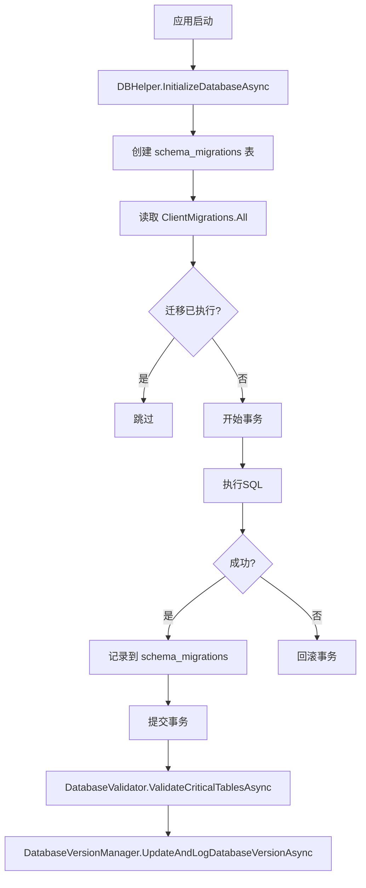

# Prophet 数据库架构文档

## 📋 目录

- [概述](#概述)
- [数据库架构](#数据库架构)
- [迁移系统](#迁移系统)
- [Repository 模式](#repository-模式)
- [使用指南](#使用指南)
- [最佳实践](#最佳实践)
- [故障排除](#故障排除)

---

## 概述

Prophet 客户端使用 **SQLite** 作为本地数据库，采用 **Schema First** 的开发模式，通过集中式迁移系统管理数据库结构变更。

### 技术栈

- **数据库**：SQLite 3
- **ORM**：Dapper (轻量级 Micro-ORM)
- **连接管理**：DBHelper 工具类
- **迁移系统**：自定义版本化迁移
- **设计模式**：Repository Pattern

### 核心特性

- ✅ **集中式迁移管理**：所有表结构变更集中在 `ClientMigrations.cs`
- ✅ **幂等性保证**：迁移可重复执行，不会重复修改
- ✅ **事务支持**：迁移失败自动回滚
- ✅ **版本追踪**：`schema_migrations` 表记录已执行的迁移
- ✅ **自动化验证**：启动时自动检查数据库完整性
- ✅ **外键约束**：启用外键支持，保证数据一致性
- ✅ **WAL 模式**：提升并发性能

---

## 数据库架构

### 核心表结构

```
Prophet.db (SQLite)
├── 系统表
│   ├── app_settings              # 应用配置
│   └── schema_migrations         # 迁移历史
│
├── 交易标的
│   └── instruments               # 交易对定义（symbol_key: BASE-EXCHANGE-TYPE）
│
├── 策略管理
│   ├── strategies                # 策略定义
│   └── strategy_versions         # 策略版本历史
│
├── 回测系统
│   ├── backtest_configs          # 回测配置
│   ├── backtest_runs             # 回测运行记录
│   ├── backtest_orders           # 回测订单
│   ├── backtest_results          # 回测结果汇总
│   ├── backtest_signals          # 回测信号（可选）
│   ├── backtest_order_signals    # 订单信号（可选）
│   ├── backtest_drawdown_periods # 回撤周期（可选）
│   └── backtest_equity_curve     # 权益曲线（可选）
│
├── 市场数据
│   ├── klines                    # K线数据（外键 → instruments）
│   ├── fundingrate               # 资金费率
│   ├── longshortratio            # 多空比
│   └── fear_greed_index          # 恐惧贪婪指数
│
└── 实盘交易
    ├── trading_instances         # 实盘实例
    ├── instance_snapshots        # 实例快照
    ├── live_orders               # 实盘订单
    └── live_sessions             # 交易会话
```

### Symbol 格式规范

**统一格式**：`BASE_SYMBOL-EXCHANGE-MARKET_TYPE`

**示例**：
```
BTCUSDT-BINANCE-SWAP    # 币安 BTC 永续合约
ETHUSDT-OKX-SWAP        # OKX ETH 永续合约
BNBUSDT-BINANCE-SWAP    # 币安 BNB 永续合约
```

**关键点**：
- ✅ 所有表使用 `symbol_key` 字段（不再使用旧的 `symbol`）
- ✅ `klines` 表通过外键约束引用 `instruments.symbol_key`
- ✅ 新交易对首次使用时会**自动注册**到 `instruments` 表

---

## 迁移系统

### 迁移文件结构

```
Database/
├── Migrations/
│   └── ClientMigrations.cs       # 所有迁移定义
├── Repositories/                 # 数据访问层
├── DBHelper.cs                   # 数据库连接管理
├── DatabaseValidator.cs          # 启动时验证
├── DatabaseVersionManager.cs     # 版本管理
└── schema.sql                    # 完整数据库结构（参考）
```

### 迁移记录格式

```csharp
new DbMigration(
    Id: "YYYY-MM-DD_NN_descriptive_name",     // 唯一标识（按日期排序）
    Description: "变更描述",                   // 人类可读的说明
    DisableForeignKeys: false,                 // 是否需要临时禁用外键
    Sql: @"
        CREATE TABLE IF NOT EXISTS ...;
        CREATE INDEX IF NOT EXISTS ...;
    "
)
```

### 迁移执行流程



### 如何添加新迁移

**步骤 1**：在 `ClientMigrations.cs` 中添加新的 `DbMigration`

```csharp
public static class ClientMigrations
{
    public static IEnumerable<DbMigration> All => new[]
    {
        // ... 现有迁移 ...
        
        new DbMigration(
            Id: "2026-01-05_01_add_new_table",
            Description: "添加新表 xyz",
            DisableForeignKeys: false,
            Sql: @"
                CREATE TABLE IF NOT EXISTS xyz (
                    id INTEGER PRIMARY KEY AUTOINCREMENT,
                    name TEXT NOT NULL,
                    created_at TEXT NOT NULL DEFAULT (datetime('now', 'localtime'))
                );
                
                CREATE INDEX IF NOT EXISTS idx_xyz_name ON xyz(name);
            "
        ),
    };
}
```

**步骤 2**：更新 `DatabaseVersionManager.cs` 中的版本号和历史

```csharp
public const string CurrentSchemaVersion = "1.5.0"; // 更新版本号

private static readonly List<(string Version, string Description, string Date)> VersionHistory = new()
{
    // ... 现有历史 ...
    ("1.5.0", "添加 xyz 表", "2026-01-05") // 添加新记录
};
```

**步骤 3**：（可选）更新 `DatabaseValidator.cs` 中的关键表列表

```csharp
var requiredTables = new[]
{
    // ... 现有表 ...
    "xyz" // 如果是关键表，添加到验证列表
};
```

**步骤 4**：运行应用，迁移会自动执行

---

## Repository 模式

### 继承层次

```
BaseRepository<TEntity, TId>        # 泛型基类，提供通用 CRUD
    ↓
MarketDataRepository               # 市场数据专用
InstrumentRepository               # 交易对管理
（其他业务Repository）
```

### BaseRepository 提供的方法

```csharp
// 查询
Task<TEntity?> GetByIdAsync(TId id)
Task<List<TEntity>> GetAllAsync()
Task<TEntity?> FindOneAsync(string whereClause, object? parameters = null)
Task<List<TEntity>> FindAsync(string whereClause, object? parameters = null)

// 写入
Task<TId> InsertAsync(TEntity entity)
Task<int> UpdateAsync(TEntity entity)
Task<int> DeleteAsync(TId id)

// 工具
Task<int> CountAsync(string? whereClause = null, object? parameters = null)
Task<bool> ExistsAsync(TId id)

// 底层执行
Task<int> ExecuteAsync(string sql, object? parameters = null)
Task<T> ExecuteScalarAsync<T>(string sql, object? parameters = null)
Task<List<T>> QueryAsync<T>(string sql, object? parameters = null)
```

### 使用示例

**示例 1：查询所有已启用的交易对**

```csharp
var repository = new InstrumentRepository();
var instruments = await repository.GetEnabledAsync();
```

**示例 2：批量插入K线数据（带自动注册）**

```csharp
var repository = new MarketDataRepository();
var count = await repository.BulkInsertKlinesAsync(
    symbol: "BTCUSDT-BINANCE-SWAP",
    interval: "15m",
    candles: candlesList
);
// 如果 BTCUSDT-BINANCE-SWAP 不存在于 instruments 表，会自动注册
```

**示例 3：自定义查询**

```csharp
var repository = new MarketDataRepository();
var klines = await repository.QueryAsync<KlineDto>(
    "SELECT * FROM klines WHERE symbol_key = @Symbol AND interval = @Interval ORDER BY open_time DESC LIMIT 100",
    new { Symbol = "BTCUSDT-BINANCE-SWAP", Interval = "15m" }
);
```

---

## 使用指南

### 1. 数据库初始化

数据库在应用启动时自动初始化，位于 `App.axaml.cs`：

```csharp
private async void InitializeDatabaseAndStartApp(IClassicDesktopStyleApplicationLifetime desktop)
{
    // 1. 初始化连接（创建数据库文件 + PRAGMA 设置）
    await DBHelper.InitializeDatabaseAsync();
    
    // 2. 执行迁移
    await DBHelper.ApplyMigrationsAsync(ClientMigrations.All);
    
    // 3. 确保默认种子数据
    var instrumentRepository = new InstrumentRepository();
    await instrumentRepository.EnsureDefaultSeedAsync();
    
    // 4. 验证关键表
    await DatabaseValidator.ValidateCriticalTablesAsync();
    
    // 5. 更新并记录版本
    await DatabaseVersionManager.UpdateAndLogDatabaseVersionAsync();
}
```

### 2. 创建连接

**推荐方式**（自动管理）：

```csharp
using var connection = DBHelper.CreateConnection();
// 连接会自动释放
```

**手动管理**：

```csharp
var connection = DBHelper.CreateConnection(customPath);
try
{
    // 使用连接
}
finally
{
    connection.Dispose();
}
```

### 3. 事务操作

```csharp
using var connection = DBHelper.CreateConnection();
using var transaction = connection.BeginTransaction();

try
{
    await connection.ExecuteAsync("INSERT INTO ...", parameters, transaction);
    await connection.ExecuteAsync("UPDATE ...", parameters, transaction);
    
    transaction.Commit();
}
catch
{
    transaction.Rollback();
    throw;
}
```

### 4. 查询数据

**单行查询**：

```csharp
using var connection = DBHelper.CreateConnection();
var result = await connection.QueryFirstOrDefaultAsync<T>(
    "SELECT * FROM table WHERE id = @Id",
    new { Id = 123 }
);
```

**多行查询**：

```csharp
using var connection = DBHelper.CreateConnection();
var results = await connection.QueryAsync<T>(
    "SELECT * FROM table WHERE status = @Status",
    new { Status = "active" }
);
```

**聚合查询**：

```csharp
using var connection = DBHelper.CreateConnection();
var count = await connection.ExecuteScalarAsync<int>(
    "SELECT COUNT(*) FROM table WHERE date > @Date",
    new { Date = DateTime.UtcNow.AddDays(-7) }
);
```

---

## 最佳实践

### ✅ 推荐做法

1. **使用 Repository 模式**
   ```csharp
   // ✅ 好
   var repo = new InstrumentRepository();
   var instruments = await repo.GetEnabledAsync();
   
   // ❌ 避免直接操作 DBHelper（除非特殊情况）
   using var conn = DBHelper.CreateConnection();
   var raw = await conn.QueryAsync<T>("...");
   ```

2. **迁移使用 `IF NOT EXISTS`**
   ```sql
   -- ✅ 好：幂等性
   CREATE TABLE IF NOT EXISTS xyz (...);
   CREATE INDEX IF NOT EXISTS idx_xyz ON xyz(...);
   
   -- ❌ 避免：非幂等
   CREATE TABLE xyz (...);
   ```

3. **外键约束**
   ```sql
   -- ✅ 好：声明外键
   symbol_key TEXT NOT NULL REFERENCES instruments(symbol_key)
   
   -- ❌ 避免：缺少外键（数据一致性风险）
   symbol_key TEXT NOT NULL
   ```

4. **自动注册交易对**
   ```csharp
   // ✅ 好：自动处理外键约束
   await marketDataRepo.BulkInsertKlinesAsync(symbol, interval, candles);
   
   // ❌ 避免：手动管理 instruments 表
   await instrumentRepo.UpsertAsync(new InstrumentDefinition { ... });
   await marketDataRepo.BulkInsertKlinesAsync(...);
   ```

5. **使用参数化查询**
   ```csharp
   // ✅ 好：防止 SQL 注入
   await conn.QueryAsync<T>("SELECT * FROM t WHERE id = @Id", new { Id = id });
   
   // ❌ 危险：SQL 注入风险
   await conn.QueryAsync<T>($"SELECT * FROM t WHERE id = {id}");
   ```

### ❌ 禁止做法

1. **❌ 分散的表初始化**
   ```csharp
   // ❌ 错误：在业务代码中创建表
   public class SomeService
   {
       public void Init()
       {
           connection.Execute("CREATE TABLE IF NOT EXISTS ...");
       }
   }
   
   // ✅ 正确：在 ClientMigrations.cs 中统一管理
   ```

2. **❌ 跳过迁移系统**
   ```csharp
   // ❌ 错误：直接修改数据库结构
   connection.Execute("ALTER TABLE xyz ADD COLUMN new_col TEXT");
   
   // ✅ 正确：通过迁移添加
   new DbMigration("2026-01-05_01_add_column", "...", false, "ALTER TABLE ...");
   ```

3. **❌ 忽略外键约束**
   ```csharp
   // ❌ 错误：插入不存在的 symbol_key
   await connection.ExecuteAsync(
       "INSERT INTO klines (symbol_key, ...) VALUES (@Symbol, ...)",
       new { Symbol = "UNKNOWN-SYMBOL" }
   ); // 抛出外键约束错误
   
   // ✅ 正确：使用带自动注册的方法
   await marketDataRepo.BulkInsertKlinesAsync("UNKNOWN-SYMBOL", ...);
   ```

---

## 故障排除

### 问题 1：外键约束失败

**错误**：
```
SQLite Error 19: 'FOREIGN KEY constraint failed'.
```

**原因**：
- 尝试插入的 `symbol_key` 在 `instruments` 表中不存在

**解决方案**：
```csharp
// 方案 1：使用带自动注册的方法
await marketDataRepo.BulkInsertKlinesAsync(symbol, interval, candles);

// 方案 2：手动注册
var instrumentRepo = new InstrumentRepository();
await instrumentRepo.EnsureInstrumentExistsAsync(symbolKey);
```

---

### 问题 2：迁移执行失败

**错误**：
```
迁移 [xxx] 执行失败: ...
```

**排查步骤**：
1. 检查 SQL 语法是否正确
2. 查看 `schema_migrations` 表，确认哪些迁移已执行
   ```sql
   SELECT * FROM schema_migrations ORDER BY applied_at DESC;
   ```
3. 如果需要重新执行，删除对应记录（**危险操作，仅开发环境**）
   ```sql
   DELETE FROM schema_migrations WHERE migration_id = 'xxx';
   ```

---

### 问题 3：数据库锁定

**错误**：
```
database is locked
```

**原因**：
- SQLite 在某些情况下不支持高并发写入
- 长时间持有事务

**解决方案**：
1. 使用 WAL 模式（已默认启用）
2. 缩短事务持有时间
3. 避免在 UI 线程执行长时间数据库操作

---

### 问题 4：启动时表验证失败

**错误**：
```
❌ 关键表缺失: xxx。请检查数据库迁移是否正确执行。
```

**解决方案**：
1. 检查 `ClientMigrations.cs` 中是否包含该表的迁移
2. 查看控制台日志，确认迁移是否成功执行
3. 如果迁移失败，查看错误信息并修复 SQL
4. 删除 `PROPHET.db` 文件，重新启动应用（**会丢失所有数据**）

---

## 附录

### 数据库文件路径

**默认位置**：
```
Prophet.Client/PROPHET.db
```

**配置位置**：`AppConfig.Database.BacktestDatabasePath`

### 相关文件

- `DBHelper.cs` - 数据库连接管理
- `ClientMigrations.cs` - 迁移定义
- `DatabaseValidator.cs` - 启动验证
- `DatabaseVersionManager.cs` - 版本管理
- `Repositories/BaseRepository.cs` - Repository 基类
- `Repositories/InstrumentRepository.cs` - 交易对管理
- `Repositories/MarketDataRepository.cs` - 市场数据管理

### 参考资源

- [SQLite 官方文档](https://www.sqlite.org/docs.html)
- [Dapper GitHub](https://github.com/DapperLib/Dapper)
- [Prophet DSL 规范](../doc/Prophet%20DSL%20规范/)

---

**文档版本**：1.0  
**最后更新**：2026-01-04  
**维护者**：Prophet 开发团队

